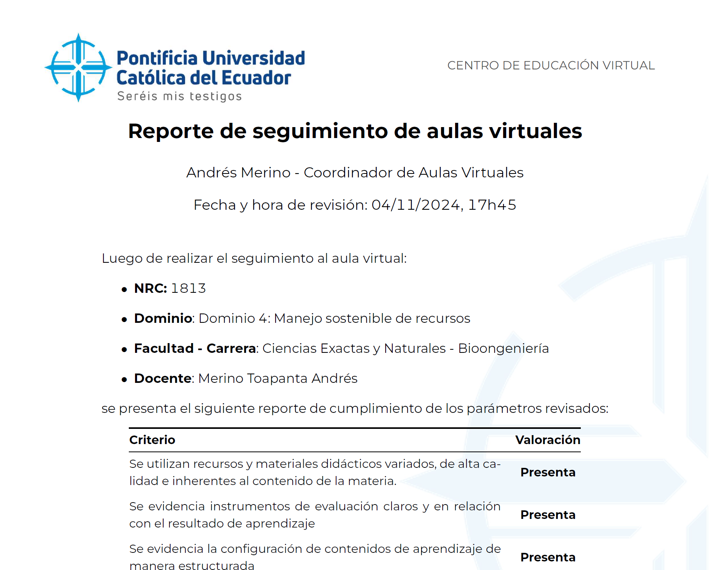
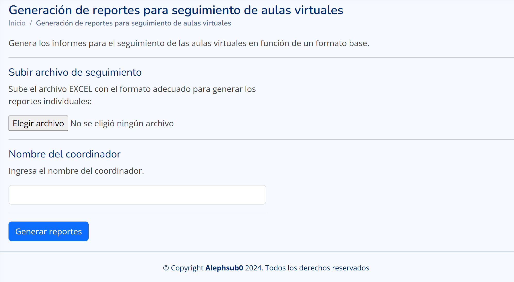

<!-- PROJECT SHIELDS -->
[![Colaboradores][contributors-shield]][contributors-url]
[![Forks][forks-shield]][forks-url]
[![Estrellas][stars-shield]][stars-url]
[![Issues][issues-shield]][issues-url]
[![MIT License][license-shield]][license-url]

<!-- PROJECT LOGO -->
 

<h3 align="center">App Web para Generar Reportes de Revisión de Aulas Virtuales - CEV PUCE</h3>
  

    Proyecto para la automatización de reportes de revisión de aulas virtuales del Centro de Educación Virtual de la PUCE.
     
    <a href="https://github.com/alephsub0/ReportesCEV/issues">Reportar un Problema</a>
    ·
    <a href="https://github.com/alephsub0/ReportesCEV/issues">Solicitar cambio</a>
  

## Sobre el Proyecto

Este proyecto tiene como objetivo desarrollar una aplicación web que permita generar reportes de revisión de aulas virtuales. Estos reportes son realizados por el Centro de Educación Virtual (CEV) de la Pontificia Universidad Católica del Ecuador (PUCE). La aplicación facilita la automatización del proceso de generación de reportes en formato LaTeX y su conversión a PDF, incluyendo la creación de archivos .zip con los reportes compilados. Un ejemplo del resultado final se muestra en la siguiente imagen:

Se expone únicamente las funciones que generan la automatización, sin incluir la interfaz web. El código se encuentra en el archivo `funciones.py`. Por otro lado, la interfaz web se encuentra generada da como resultado el que se muestra en la siguiente imagen:

### Construido con

  

## Descripción

El proyecto incluye el siguiente código y lógica:
- **Funciones principales**:
  - `reemplazar_datos(texto, df_revision, n)`: Reemplaza los marcadores de posición en un texto con valores específicos de un DataFrame.
  - `leer_archivo_revision(archivo_revision)`: Lee un archivo de revisión en formato Excel y genera un DataFrame.
  - `procesar_seguimiento(archivo_revision, nombre_coordinador)`: Procesa el seguimiento de aulas, genera archivos LaTeX, los compila a PDF y crea un archivo .zip con los resultados.

En necesario tener instalado LaTeX para compilar los archivos a PDF.

### Pruebas

El proyecto ha sido probado con Python 3.10 y las siguientes versiones de librerías:
- Tex Live 2023

Errores reportados:
- No se han reportado errores hasta el momento.

## Créditos

**Andrés Merino**\
[Proyecto Alephsub0](https://www.alephsub0.org/about/),\
Docente Investigador\
Pontificia Universidad Católica del Ecuador\
aemerinot@gmail.com\
[![LinkedIn][linkedin-shield]][linkedin-url-aemt]
[![GitHub][github-shield]][github-url-aemt]

**Daniel Lara**\
[Proyecto Alephsub0](https://www.alephsub0.org/about/),\
Estudiante de Matemática\
Escuela Politécnica Nacional\
[![LinkedIn][linkedin-shield]][linkedin-url-dl]
[![GitHub][github-shield]][github-url-dl]

## Licencia

Distribuido bajo la licencia MIT. 

[![MIT License][license-shield]][license-url]

<!-- MARKDOWN LINKS & IMAGES -->
[contributors-shield]: https://img.shields.io/github/contributors/alephsub0/ReportesCEV.svg?style=for-the-badge
[contributors-url]: https://github.com/alephsub0/ReportesCEV/graphs/contributors
[forks-shield]: https://img.shields.io/github/forks/alephsub0/ReportesCEV.svg?style=for-the-badge
[forks-url]: https://github.com/alephsub0/ReportesCEV/forks
[stars-shield]: https://img.shields.io/github/stars/alephsub0/ReportesCEV?style=for-the-badge
[stars-url]: https://github.com/alephsub0/ReportesCEV/stargazers
[issues-shield]: https://img.shields.io/github/issues/alephsub0/ReportesCEV.svg?style=for-the-badge
[issues-url]: https://github.com/alephsub0/ReportesCEV/issues
[license-shield]: https://img.shields.io/github/license/alephsub0/ReportesCEV.svg?style=for-the-badge
[license-url]: https://es.wikipedia.org/wiki/Licencia_MIT
[linkedin-shield]: https://img.shields.io/badge/linkedin-%230077B5.svg?style=for-the-badge&logo=linkedin&logoColor=white
[linkedin-url-aemt]: https://www.linkedin.com/in/andrés-merino-010a9b12b/
[linkedin-url-dl]: https://www.linkedin.com/in/mat-daniel-lara/
[github-shield]: https://img.shields.io/badge/github-%23121011.svg?style=for-the-badge&logo=github&logoColor=white
[github-url-aemt]: https://github.com/andres-merino
[github-url-dl]: https://github.com/daniel-lara-ec
